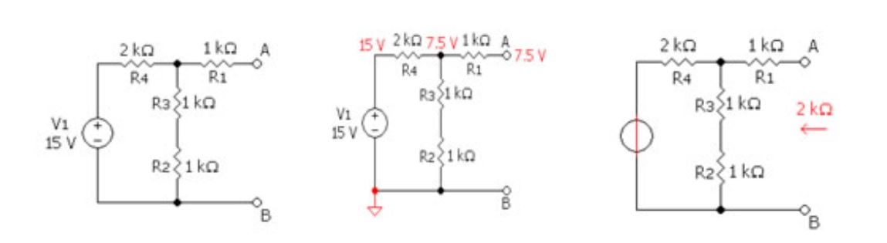
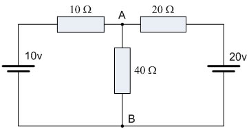
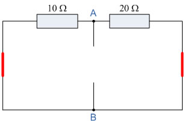
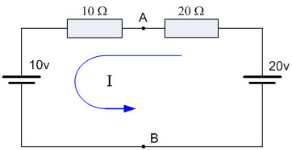
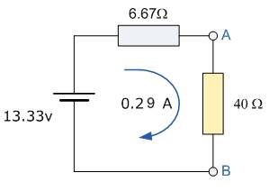
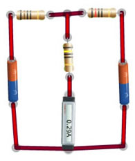
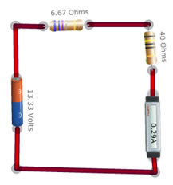

### Theory 

In electrical circuit theory, <strong>Thevenin’s theorem</strong> for linear electrical networks states that any combination of voltage sources, current sources, and resistors with two terminals is electrically equivalent to a single voltage source <strong>V</strong> and a single series resistor <strong>R</strong>. For single frequency AC systems, the theorem can also be applied to general impedances, not just resistors. Any complex network can be reduced to a Thevenin's equivalent circuit consisting of a single voltage source and series resistance connected to a load.

To calculate the equivalent circuit, one needs a resistance and some voltage — two unknowns. Thus, two equations are needed. These two equations are usually obtained by using the following steps, but any conditions one places on the terminals of the circuit should also work:

<ol>
  <li>Calculate the output voltage, <strong>VAB</strong>, when in open circuit condition (no load resistor — meaning infinite resistance). This is <strong>VTh</strong>.</li>
  <li>Calculate the output current, <strong>IAB</strong>, when the output terminals are short-circuited (load resistance is 0). <strong>RTh</strong> equals <strong>VTh</strong> divided by <strong>IAB</strong>.</li>
</ol>

The Thevenin-equivalent voltage is the voltage at the output terminals of the original circuit. When calculating a Thevenin-equivalent voltage, the voltage divider principle is useful, by declaring one terminal to be <strong>Vout</strong> and the other terminal to be at the ground point.

The Thevenin-equivalent resistance is the resistance measured across points A and B, "looking back" into the circuit. It is important to first replace all voltage and current sources with their internal resistances. For an ideal voltage source, this means replacing the voltage source with a short circuit. For an ideal current source, this means replacing the current source with an open circuit. Resistance can then be calculated across the terminals using the formulas for series and parallel circuits.

<strong>In short, the steps are:</strong>

<ol>
  <li>Find the Thevenin source voltage by removing the load resistor from the original circuit and calculating voltage across the open connection points where the load resistor used to be.</li>
  <li>Find the Thevenin resistance by removing all power sources in the original circuit (voltage sources shorted and current sources open), and calculating total resistance between the open connection points.</li>
  <li>Draw the Thevenin equivalent circuit, with the Thevenin voltage source in series with the Thevenin resistance. The load resistor re-attaches between the two open points of the equivalent circuit.</li>
  <li>Analyze voltage and current for the load resistor following the rules for series circuits.</li>
</ol>

<strong>Example 1:</strong>

For example, consider the following circuit:

Firstly, we have to remove the centre <strong>40&#8486;</strong> resistor and short out (not physically, as this would be dangerous) all the <strong>emfs</strong> connected to the circuit, or open-circuit any current sources.

The value of resistor <strong>Rs</strong> is found by calculating the total resistance at the terminals A and B with all the EMFs removed. The value of the voltage required, <strong>Vs</strong>, is the total voltage across terminals A and B with an open circuit and no load resistor <strong>Rs</strong> connected.

Then, we get the following circuit:

### Find the Equivalent Resistance (Rs):

10&#8486; resistor in parallel with 20&#8486; resistor.

The equivalent resistance is given by:

$$R_T = \frac{R_1 \times R_2}{R_1 + R_2} = \frac{20 \times 10}{20 + 10} = 6.67\ \Omega$$

### Find the Equivalent Voltage (Vs):

We now need to reconnect the two voltages back into the circuit, and as <strong>VS = VAB</strong> the current flowing around the loop is calculated as:

$$I = \frac{20v - 10v}{20\Omega + 10\Omega} = 0.33\ amps$$

So the voltage drop across the 20&#8486; resistor can be calculated as:

<strong>VAB = 20 − (20&#8486; × 0.33 amps) = 13.33 volts.</strong>

Then the <strong>Thevenin’s Equivalent</strong> circuit is shown below with the 40&#8486; resistor connected.

And from this the current flowing in the circuit is given as:

$$I = \frac{13.33\,\mathrm{V}}{6.67\,\Omega + 4\,\Omega} = 0.29\,\mathrm{A} $$

<strong>Thevenin’s theorem</strong> can be used as a circuit analysis method and is particularly useful if the load is to take a series of different values. It is not as powerful as Mesh or Nodal analysis in larger networks because the use of Mesh or Nodal analysis is usually necessary in any Thevenin exercise, so it might well be used from the start. However, Thevenin’s equivalent circuits of transistors, voltage sources such as batteries, etc., are very useful in circuit design.

### Verification of Thevenin’s Theorem using the simulator

<strong>Step 1:</strong> Create the actual circuit and measure the current across the load points.

<strong>Step 2:</strong> Create the Thevenin’s equivalent circuit by first creating the equivalent voltage source and equivalent resistance, and then measure the current across the load using an ammeter.

In both the cases the current measured across the resistance should be of the same value.

## Applications of Thevenin's Theorem

Thevenin's Theorem is especially useful in analyzing power systems and other circuits where one particular resistor in the circuit (called the <em>"load"</em> resistor) is subject to change, and re-calculation of the circuit is necessary with each trial value of load resistance to determine voltage across it and current through it.

Source modeling and resistance measurement using the Wheatstone bridge provide applications for Thevenin’s Theorem.

<strong>Practical Limitations:</strong>

<ul>
  <li>Many, if not most circuits, are only linear over a certain range of values. Thus, the <strong>Thevenin equivalent</strong> is valid only within this linear range and may not be valid outside of it.</li>
  <li>The Thevenin equivalent has an equivalent I-V characteristic only from the point of view of the load.</li>
  <li>The power dissipation of the Thevenin equivalent is not necessarily identical to the power dissipation of the real system. However, the power dissipated by an external resistor between the two output terminals is the same regardless of how the internal circuit is represented.</li>
</ul>

